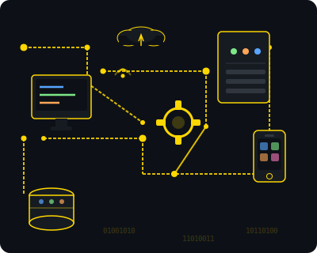

  

<h1 align="center">Hi 👋, I'm Rashmi Rathnayaka</h1>

  

<h3 align="center">A passionate Full-Stack Developer from Sri Lanka</h3>

  

<table border="0" cellpadding="" cellspacing="5" width="100%">
  <tr>
    <td width="65%" valign="top">
      
🌱 I’m currently learning **React.js, Node.js, MongoDB, Tailwind CSS, System Design**

🎓 I'm an Undergraduate at **SLIIT**

👨‍💻 All of my projects are available at [https://rashmirathnayaka.github.io/My-Portfolio/](https://rashmirathnayaka.github.io/My-Portfolio/)

💬 Ask me about **React, JavaScript (ES6+), UI Design, MERN Stack**

📫 How to reach me **rashmipra02@gmail.com**

⚡ Fun fact **I enjoy turning complex ideas into clean and user-friendly interfaces** 😄
</td>
    <td width="35%" valign="top" align="right">
      
    </td>
  </tr>
</table>

  
  

<h3>Connect with me:</h3>

<h3>Skills Set:</h3>

These are some of the major technologies that I use or have worked on in the past:

**Programming Languages**

  

**Libraries and Frameworks**

       

**Databases**

 

**Tools**

     

